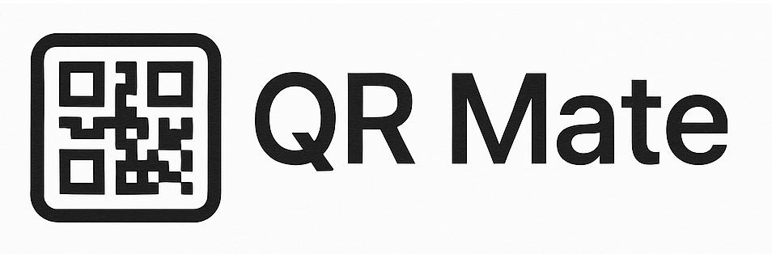
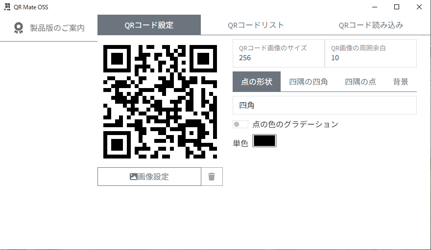
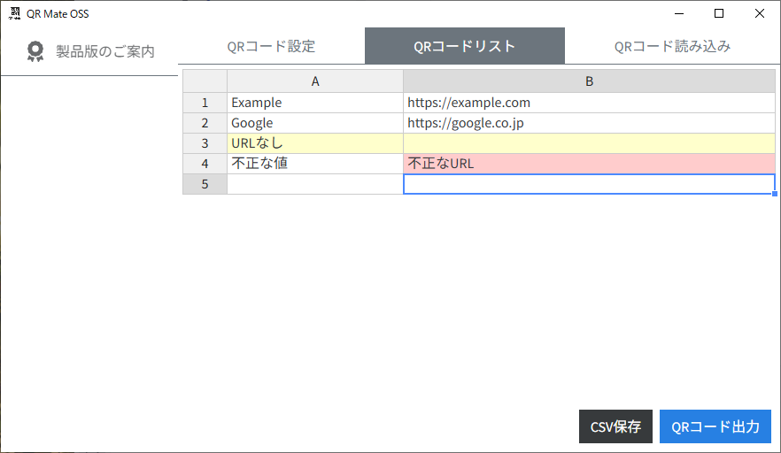
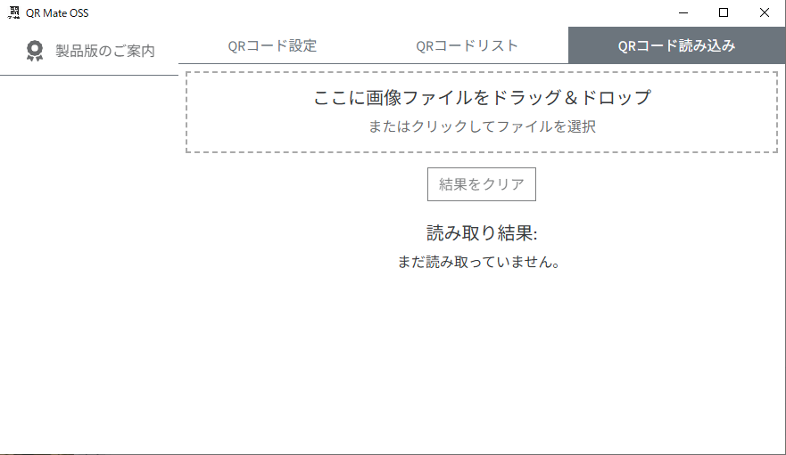

# QR Mate OSS – 高速・高機能なオフラインQRコード生成アプリ（オープンソース版）

## 概要

### QR Mate OSS – 高速・高機能なオフラインQRコード生成アプリ（オープンソース版）



- **QR Mate OSS** は、完全オフラインで動作するQRコード生成・カスタマイズアプリです。
- Excelやスプレッドシートからの大量データ貼り付けに対応し、シンプルで高速な一括QR生成を実現します。
- スタンドアロンなアプリとして、セキュリティを重視した現場業務にも適応可能です。
- オープンソースで提供されてます。

## **特徴**

- ✅ **完全オフライン対応** – インターネット接続が無い環境でも完全動作
- ✅ **QRコードの一括生成（PNG形式）**
- ✅ **QRコード画像ファイルからの連続読み取り・ファイル保存**
- ✅ **自由なデザインカスタマイズ**
    - 色変更・形状選択・中央ロゴ挿入対応
- ✅ **ExcelやGoogleスプレッドシートなどから大量データを貼り付け対応**
- ✅ **Tauri + Rust + React による高パフォーマンス実装**
- ✅ **MITライセンスで自由に利用・改変可能**
- ✅ **Windows(x86_64) / macOS(Intel & Apple Silicon) / Linux(x86_64) 対応**

## **製品版限定の追加機能（**製品版**）**

オープンソース版に含まれない機能一覧：

- ☑️ **QRコード生成・読み込み履歴**
- ☑️ **CSV・Excelファイル直接読み込み**
    - Excel ファイル読み込みは実装途中
- ☑️ **ZIP圧縮一括保存機能**
- ☑️ **WebカメラによるリアルタイムQRコード読み取り**

> 👉 これらの機能は法人向け製品版にされます。
>
>
> 製品版導入や権利譲渡をご希望の場合は、このドキュメント最下部の連絡先よりお問い合わせください。
>

---

## **インストール・ビルド手順**

### **1. クローン**

```bash
git clone https://github.com/lembryo/qr-mate.com-oss.git
cd qr-mate.com-oss

```

### **2. 依存関係のインストール**

```bash
npm install
```

### **3. アプリ起動（開発モード）**

```bash
npm run tauri dev
```

### **4. アプリのビルド（配布用）**

```bash
npm run tauri build
```

## **スクリーンショット**

<table>
  <tr>
    <td></td>
    <td></td>
    <td></td>
  </tr>
</table>

## **ライセンス**

### QR Mate OSS 本体ライセンス

このプロジェクトは **MITライセンス** のもとで公開されています。

自由に利用・複製・改変・再配布いただけます。

### **サードパーティライブラリ・OSSに関するご注意**

本アプリには以下の種類のOSSライブラリ・フォント・アイコンが含まれます：

- MITライセンス、Apache License 2.0、BSD系、ISC等：

  → いずれもMITライセンスとの互換性がありますが、各OSS本来のライセンス条件（著作権表示やライセンス条項の同梱義務など）を遵守しています。

  一部OSSの**著作権表示・ライセンス文書**は `THIRD_PARTY_LICENSES.txt` として同梱しています。

- **Font Awesome Free** のフォント（OFL 1.1）、アイコン（CC BY 4.0）：
    - フォントファイル部分は [SIL Open Font License 1.1（OFL 1.1）](https://scripts.sil.org/OFL)
      に準拠し、MITライセンスでの再配布はできません。→ **本アプリに含まれるフォントファイルはOFL 1.1のもとで再配布されます。
      **
    -
  アイコン（SVG/JS形式）は [Creative Commons Attribution 4.0 International（CC BY 4.0）](https://creativecommons.org/licenses/by/4.0/)
  で配布され、著作権表示が必要です。→ 本アプリには必要な著作権表示を行っています。
- **ブランドアイコン**について：

  Font Awesomeのブランドアイコンは各社の商標です。ブランドやサービスを示す用途以外での利用はできません。

- **Apache License 2.0** 採用のライブラリについて：

  著作権表示やライセンス条項を、`THIRD_PARTY_LICENSES.txt` にまとめて同梱しています。

**本アプリに含まれる全てのOSSライブラリのライセンス詳細・著作権表示は** `THIRD_PARTY_LICENSES.txt` **をご確認ください。**

### **クレジット・著作権表示例**

- Font Awesome Free by [Fonticons, Inc.](https://fontawesome.com/), licensed
  under [CC BY 4.0](https://creativecommons.org/licenses/by/4.0/)（アイコン/SVG,
  JS形式）および [SIL OFL 1.1](https://scripts.sil.org/OFL)（フォント）
- 一部OSSライブラリは MIT, Apache-2.0, BSD系等でライセンスされています。
- 詳細は同梱の `THIRD_PARTY_LICENSES.txt` を参照してください。

## **製品版 / 権利譲渡のお問い合わせ**

QR Mateの製品版では、以下の機能を追加で提供しています：

- ☑️ QRコード生成・読み込み履歴
- ☑️ CSV・Excelファイル直接読み込み
- ☑️ ZIP圧縮一括保存機能
- ☑️ WebカメラによるリアルタイムQRコード読み取り

製品版導入、またはアプリの**権利ごと譲渡のご相談**は以下までご連絡ください

- [**mao.lembryo@gmail.com**](mailto:mao.lembryo@gmail.com)

## **Star で応援！**

もしこのアプリが気に入ったら、GitHubでStarをいただけると励みになります。

ぜひ自由に使ってください！
